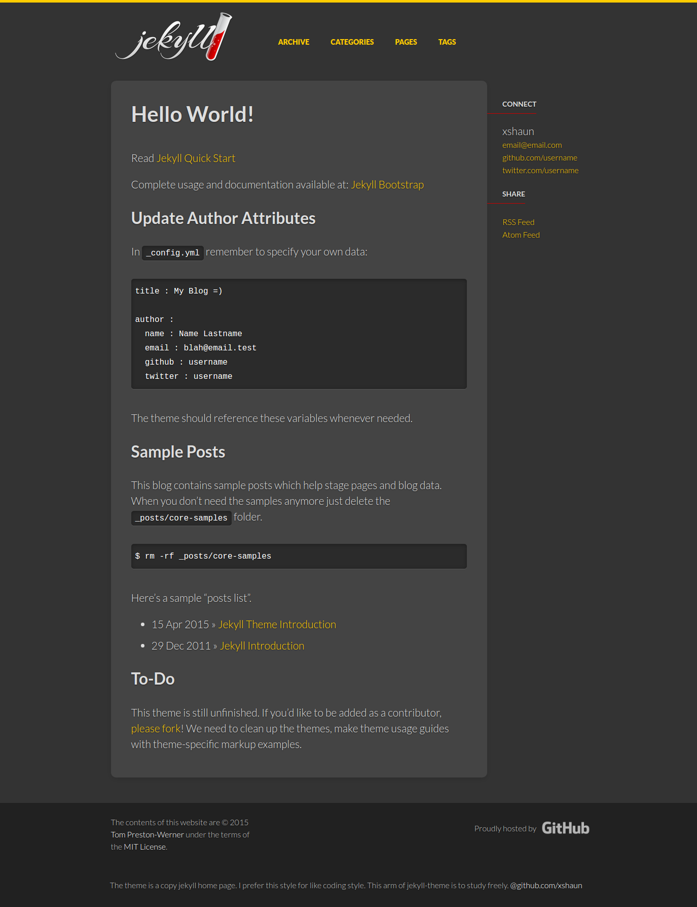

## Theme info
	
Theme Name: jekyll-theme   
Description: a theme for [jekyll](http://jekyllrb.com/). Theming is done on [Jekyll-Bootstrap](http://jekyllbootstrap.com/).  
Author: xshaun @ https://github.com/xshaun     
Demo URL: [xshaun.github.io/jekyll-theme/](http://xshaun.github.io/jekyll-theme/)   

## About jekyll-theme

Jekyll-theme is a copy from jekyll home page for the sytle of Jekyll home page is pretty good.
Jekyll-theme is only a studying freely and does not contain any commercial activity.  

ALL Files   
|---assets/themes/jekyll-theme   
|---_include/themes/jekyll-theme   
|---_layout   
|---_post/core-samples   
|---404.html  
 

## About me

I'm SXY who is a coder, China.

## How to use it?

####Build a development environment(on Ubuntu14.04)   
1. sudo apt-get install ruby1.9.1-dev   
2. gem install jekyll   

####Browse jekyll-theme   
1. download jekyll-bootstrap.     
2. copy jekyll-theme into jekyll-bootstrap folder.    
3. ~$ cd jekyll-bootstrap    
4. ~/jekyll-bootstrap$ jekyll serve  
5. browse to http://localhost:4000  

